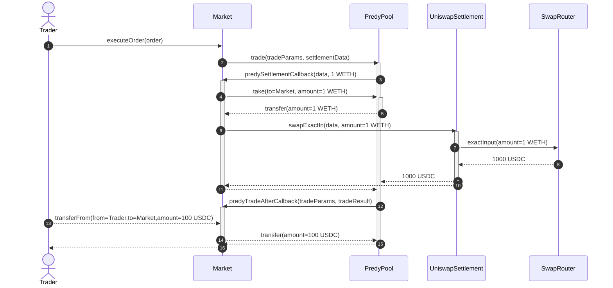
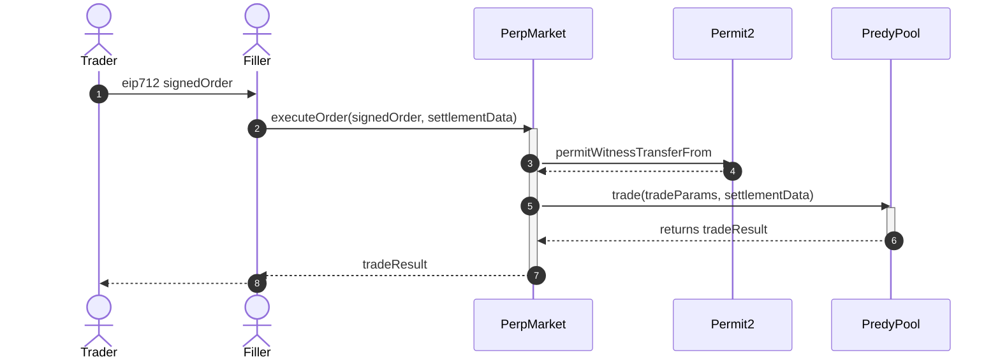
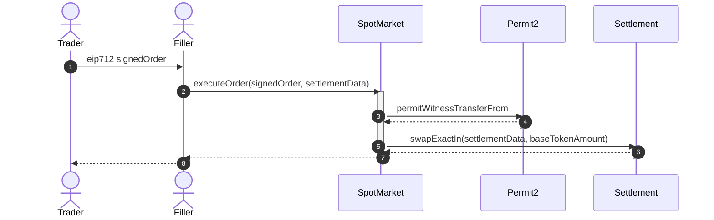

predy6
=====


[](https://x.com/predyfinance)

## Overview

Predy is an on-chain exchange for trading Gamma and Perpetuals. It features Squart, which allows trading of perpetuals with gamma exposure covered by Uniswap V3.

- [Website](https://www.predy.finance)
- [Documentation](https://docs.predy.finance)
- [Blog](https://predyfinance.medium.com/)

## Development

```
# Installing dependencies
npm i
forge install

# Testing
forge test
```

## Architecture

This project features multiple market contracts centered around PredyPool. The market contracts define financial products and order types. Markets can leverage positions by utilizing PredyPool for token lending and borrowing. This architecture is highly scalable. For example, developers can create new futures exchanges with minimal code and gain leverage by connecting to PredyPool.

### PredyPool.sol

The process of shorting 1 WETH with a collateral of 100 USDC.



### PerpMarket.sol

Limit order flow of PerpMarket.



### SpotMarket.sol

Market order flow of SpotMarket.


